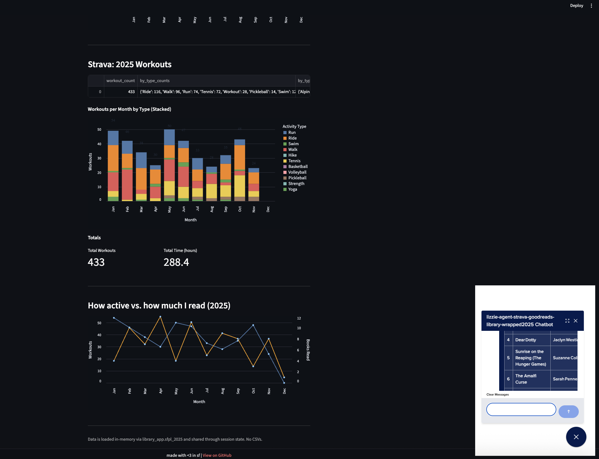
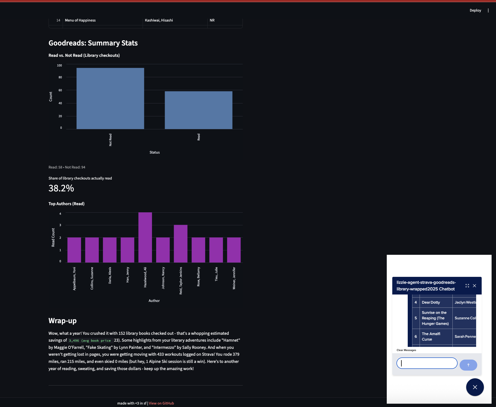

### Personal Wrapped for 2025 with SF Public Library, Goodreads, and Strava




Watch the [full YouTube video here](https://www.youtube.com/watch?v=q6Vi40OkXkA)

Add a .env with your SF Public Library username and password and DigitalOcean MODEL_ACCESS_KEY ([get one here](https://docs.digitalocean.com/products/gradient-ai-platform/how-to/use-serverless-inference/#keys))
```bash
USERNAME=
PASSWORD=
MODEL_ACCESS_KEY=
```

To get your Goodreads data and Strava data:
- [Export Strava data here](https://www.strava.com/athlete/delete_your_account)

- [Export Goodreads data here](https://www.goodreads.com/review/import)

Save and replace the file paths in lines 22 and 23 in `library_app.py`.

Run `library_app` first to get your data via Playwright.

Then run the Streamlit app `library_streamlit_app.py`. 

- `library_app.py`: main script for scraping your SFPL library data using Playwright, loading Goodreads and Strava CSVs, merging and cleaning data, and generating a year-end wrap-up summary using Gradient AI. Also saves processed data to CSVs. (See `csv_data`, which also has my exported Strava and Goodreads data)
- `library_data.py`: helper function to fetch and return all processed data (library, Goodreads, Strava) in-memory for use in the Streamlit app w/o reading/writing files
- `library_goodreads_helpers.py`: helper funcs for cleaning Goodreads book data and computing book statistics (e.g., average rating, total pages, top authors).
- `library_streamlit_app.py`: Streamlit web app for visualizing your 2025 library, Goodreads, and Strava data. Fetches data from `library_data.py`  and displays interactive charts + summaries.
- `strava_helpers.py`: helper funcs for cleaning and analyzing Strava workout data, including categorization + statistics.
- `wrapup_2025.txt`: example output of year-end wrap-up summary generated by DO Gradient AI
- `csv_data`: folder contains CSVs with processed data
    - `goodreads_book_stats_2025.csv`: Summary stats from Goodreads (only 2025, using `strava_helpers.py` to exclude !2025 yrs)
    - `goodreads_books_2025.csv`: cleaned Goodreads books for 2025.
    - `library_books_2025.csv`: books checked out from SFPL in 2025.
- `requirements.txt`: Python dependencies for the project.
- `packages.txt`: sys packages needed for Playwright and browser automation, app deployment to DigitalOcean App Platform
- `Dockerfile`: container setup for running the app (with Playwright and Streamlit) on DigitalOcean App Platform